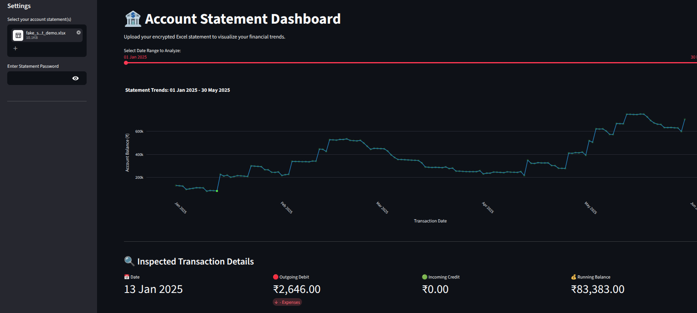
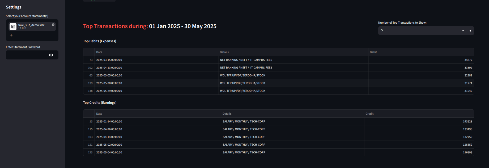
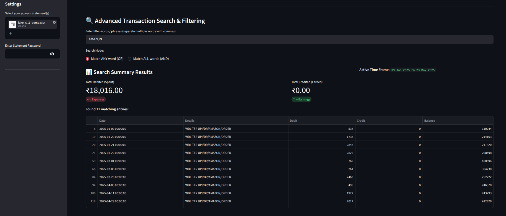

# 🏦 Multi-Statement Account Dashboard 📊

[](https://streamlit.io)
[](https://www.python.org/downloads/)
[](https://opensource.org/licenses/MIT)

An advanced, privacy-first financial intelligence dashboard built with Python and Streamlit. This application allows users to upload multiple overlapping, password-protected bank statements (`.xlsx`), automatically decrypts them securely in memory, merges the timelines, eliminates duplicate entries, and generates interactive data visualizations.

---

## 📺 YouTube Walkthrough & Demo
> 💡 *Want to see this project built from scratch? Yotube Video coming soon! This is dummy link!*
> 
> [](YOUR_YOUTUBE_VIDEO_LINK_HERE)

---

## ⚡ Key Architecture & Features

### 🔒 Privacy-First Decryption & Smart Inspection
* **On-the-Fly Processing:** Uses `msoffcrypto-tool` to decrypt statements directly inside memory buffers (`io.BytesIO`). Your sensitive physical bank files are **never saved to disk or persistent storage**.
* **Auto-Encryption Check:** Features an intelligent pre-flight verification system. It natively senses whether a file is password-protected or completely raw, adapting its data extraction pipeline dynamically.

### 🧩 Seamless Statement Synchronization
* **Overlapping Multi-File Sync:** Drag and drop multiple statement chunks covering separate or overlapping timelines at the same time.
* **Intelligent De-duplication:** Automatically identifies identical intersecting boundary rows across multiple statements, purges the clones, and builds a pristine, single chronological master timeline.

### 📉 Interactive Plotly Crosshairs & Live Drill-Downs
* **Performance Caching:** Powered by `@st.cache_data` to ensure fluid interface interactions. File parsing runs exactly once, making secondary layout interactions instant.
* **On-Select Inspector Engine:** Leverage Plotly's tracking engine. Click on any coordinate milestone dot on the main balance trend line to anchor and display an isolated transaction detail card below the chart instantly.

### 🔍 Advanced Logical Boolean Search Matrix
* **Flexible Filtering:** Instantly filter data frames using a date crop window slider.
* **AND/OR Regex Operators:** Run complex multi-keyword searches (e.g., `MUJIP, ZERODHA, SWIGGY`). Choose between **Match ANY word (OR)** or **Match ALL words (AND)** lookaround modes to calculate dynamic spend summaries instantly.

---

## 📸 Interface Preview

### 1. Main Financial Performance Workspace
*A unified overview showing running account trends alongside interactive point inspection.*





### 2. Multi-Keyword Filtering & Advanced Search Metrics
*Isolate exact financial nodes across thousands of line items using Regex search modes.*



---

## 🚀 Quick Start & Installation

### 📦 Prerequisites
Ensure you have [Miniconda or Anaconda](https://docs.conda.io/en/latest/) installed.

### 1. Environment Construction
Clone this repository and spin up your development environment using the clean, cross-platform configuration:

```bash
# Clone the repository
git clone [https://github.com/Mcubeadmin/income_playbook.git](https://github.com/Mcubeadmin/income_playbook.git)
cd income_playbook

# Create and activate the conda network environment
conda create -n bank python=3.12 -y
conda activate bank

# Install dependencies using standard pip freeze distribution tracking
pip install streamlit pandas plotly openpyxl msoffcrypto-tool
```
### 2. Boot Up the Dashboard
```bash
streamlit run app.py
```
The dashboard interface will spin up natively inside your default web browser at http://localhost:8501.

### 📝 Demo / Mock Data Generation
Want to test the layout or show it off on your own channel without leaking your private banking data? Run the built-in generator script to build realistic mock Excel statements that match the application footprint perfectly:

```bash
python generate_fake_data.py
```
Note: To simulate password parsing on camera, simply open the generated fake_statement_demo.xlsx file inside Excel or LibreOffice, go to File ➔ Info ➔ Encrypt with Password, set a key (e.g., 1234), and hit save!

### 🛠️ Tech Stack Core Layout
Frontend UI: Streamlit Layout Architecture

Data Core: Pandas (Dataframe Sorting, De-duplication, & Vectorized Lookarounds)

Visual Graphics: Plotly Express (Interactive Core Graphs with On-Select Rerun Triggers)

Crypto Engine: Msoffcrypto Tool (In-Memory Binary Decryption)

⚖️ License
Distributed under the MIT License. See LICENSE for more information.
